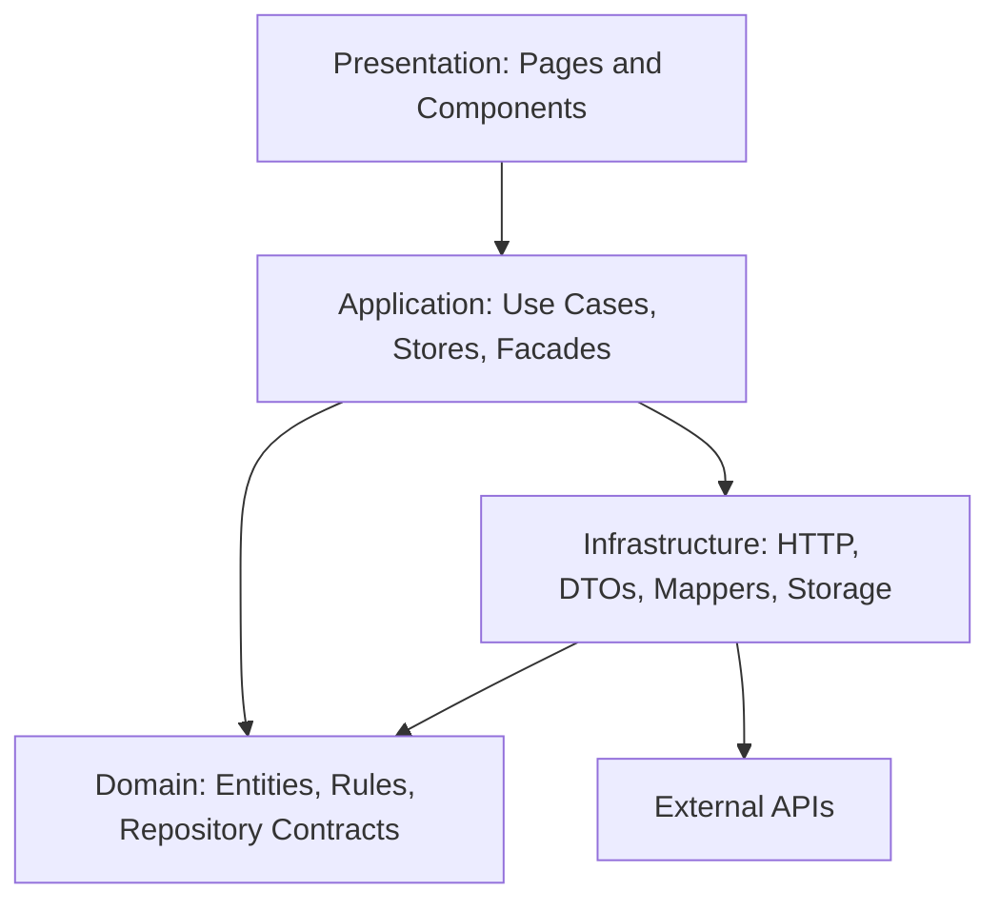
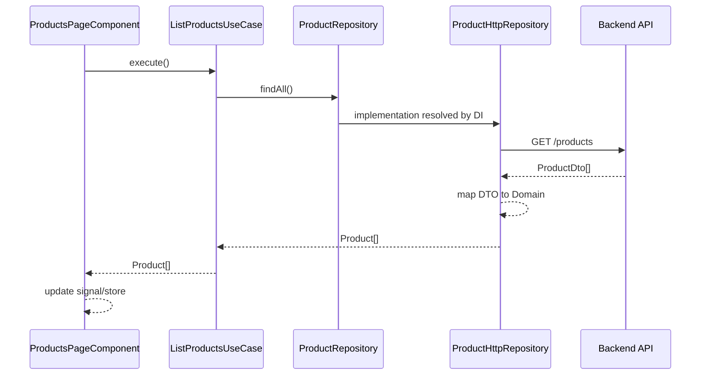

# Arquitectura Angular 22 con Screaming Architecture + Clean Architecture

## 1. Objetivo del documento

Este documento explica cómo estructurar una aplicación Angular moderna usando dos enfoques complementarios:

1. **Screaming Architecture**: la estructura del proyecto debe comunicar el negocio o dominio principal de la aplicación.
2. **Clean Architecture**: el código debe organizarse en capas con dependencias controladas, separando reglas de negocio, casos de uso, presentación e infraestructura.

La idea no es crear carpetas por crear, sino construir una arquitectura que permita que la aplicación sea mantenible, escalable, testeable y fácil de entender por nuevos desarrolladores.

---

## 2. Contexto: Angular moderno y Angular 22

Angular moderno favorece una forma de desarrollo más modular, directa y orientada a componentes independientes. En las versiones recientes, los componentes standalone son el enfoque principal, lo que reduce la dependencia de `NgModule` para organizar la aplicación.

Según la documentación oficial de Angular, los componentes son standalone por defecto y pueden importarse directamente desde otros componentes. Esto permite estructurar aplicaciones por rutas, features y componentes más independientes.  
Referencia: https://angular.dev/guide/components

Angular también recomienda el uso de lazy loading para dividir el código en chunks que se cargan bajo demanda cuando el usuario visita una ruta. Esto encaja muy bien con una arquitectura basada en features o dominios.  
Referencia: https://angular.dev/guide/routing/loading-strategies

Además, Angular cuenta con inyección de dependencias jerárquica, lo cual permite registrar providers a nivel global, por ruta, por componente o por feature. Esto es muy útil para aplicar Clean Architecture, porque permite conectar abstracciones del dominio con implementaciones concretas de infraestructura.  
Referencia: https://angular.dev/guide/di/defining-dependency-providers

Angular también incluye Signals como sistema reactivo para manejar estado y optimizar actualizaciones de renderizado.  
Referencia: https://angular.dev/guide/signals

---

## 3. Qué es Screaming Architecture

Screaming Architecture es una idea propuesta por Robert C. Martin. El principio central es que la arquitectura de una aplicación debe “gritar” el propósito del sistema, no el framework ni los detalles técnicos.

Una aplicación no debería comunicar primero esto:

```txt
components/
services/
models/
pages/
utils/
```

Eso grita tecnología.

En cambio, debería comunicar esto:

```txt
auth/
products/
orders/
payments/
students/
procedures/
inventory/
quotations/
```

Eso grita negocio.

La pregunta clave es:

> Si un nuevo desarrollador abre el proyecto por primera vez, ¿puede entender rápidamente qué hace el sistema?

Si la respuesta es sí, la arquitectura está comunicando el dominio. Si solo ve carpetas genéricas como `components`, `services` o `helpers`, entonces la estructura está centrada en el framework, no en el negocio.

---

## 4. Qué es Clean Architecture en general

Clean Architecture es un enfoque de diseño de software que busca separar responsabilidades y proteger las reglas de negocio de los detalles externos.

Su idea principal es:

> Las reglas importantes del sistema no deben depender de frameworks, bases de datos, APIs, pantallas ni librerías externas.

Es decir, el corazón de la aplicación debe ser independiente de los detalles técnicos.

En una aplicación típica, los detalles cambian constantemente:

- Cambia el backend.
- Cambian los endpoints.
- Cambia el diseño visual.
- Cambia el framework.
- Cambia la librería de estado.
- Cambia el proveedor de autenticación.
- Cambia la forma de persistir datos.

Pero las reglas de negocio suelen ser más estables:

- Un usuario inicia sesión.
- Un estudiante consulta sus pagos.
- Un cliente aprueba una cotización.
- Un técnico solicita materiales.
- Un producto tiene stock disponible.
- Una orden de trabajo puede estar pendiente, aprobada o finalizada.

Clean Architecture busca que esas reglas estables no queden mezcladas con detalles técnicos inestables.

---

## 5. La regla de dependencia

La regla más importante de Clean Architecture es la **Dependency Rule**:

> Las dependencias del código deben apuntar hacia adentro, hacia las reglas de negocio, nunca hacia afuera.

Representación simple:

```txt
Presentation  →  Application  →  Domain
Infrastructure  →  Domain
```

El dominio no debe depender de presentación ni de infraestructura.

Correcto:

```txt
ProductPageComponent
  → ListProductsUseCase
    → ProductRepository interface
      → ProductHttpRepository
```

Incorrecto:

```txt
ProductPageComponent
  → HttpClient
    → /api/products
```

En el ejemplo incorrecto, la vista queda acoplada directamente al backend. Si cambia el endpoint, el DTO, la fuente de datos o la forma de obtener productos, la pantalla se ve afectada.

En el ejemplo correcto, la pantalla solo conoce un caso de uso. El caso de uso conoce una abstracción del repositorio. La implementación concreta puede cambiar sin afectar la presentación ni el dominio.

---

## 6. Capas clásicas de Clean Architecture

Clean Architecture suele representarse con varias capas concéntricas. Mientras más al centro está una capa, más importante y estable es.

### 6.1 Entidades o dominio

Contienen las reglas más puras del negocio.

Ejemplos:

- `User`
- `Product`
- `Order`
- `Payment`
- `Student`
- `Quotation`
- `WorkOrder`

Esta capa no debería saber nada de Angular, HTTP, Firebase, HTML, CSS, LocalStorage o rutas.

### 6.2 Casos de uso o aplicación

Representan acciones que el usuario o el sistema puede ejecutar.

Ejemplos:

- `LoginUseCase`
- `ListProductsUseCase`
- `CreateOrderUseCase`
- `ApproveQuotationUseCase`
- `RegisterMerchandiseEntryUseCase`
- `GetStudentPaymentsUseCase`

Esta capa coordina el flujo de una operación. No debería contener detalles visuales ni detalles técnicos de API.

### 6.3 Adaptadores de interfaz

Transforman datos entre el mundo externo y el mundo interno.

En frontend, aquí aparecen elementos como:

- Mappers.
- DTOs.
- Presenters.
- View models.
- Repositories concretos.
- Adaptadores para API, storage o servicios externos.

### 6.4 Frameworks y drivers

Son los detalles externos:

- Angular.
- HttpClient.
- Router.
- Firebase.
- LocalStorage.
- IndexedDB.
- APIs REST.
- GraphQL.
- Librerías UI.
- Servicios externos.

Clean Architecture no dice que estos elementos sean malos. Dice que no deberían dominar la estructura del sistema.

---

## 7. Clean Architecture aplicada al frontend

A veces se piensa que Clean Architecture solo aplica al backend. Sin embargo, en frontend también hay lógica importante que debe protegerse.

En una aplicación frontend existen distintos tipos de lógica:

### 7.1 Lógica de presentación

Es la lógica relacionada con la UI.

Ejemplos:

- Mostrar u ocultar un modal.
- Activar un loading.
- Pintar un error.
- Controlar un formulario.
- Cambiar una pestaña activa.
- Ordenar columnas de una tabla.

Esta lógica vive cerca de los componentes, páginas, stores o view models.

### 7.2 Lógica de aplicación

Es la lógica del flujo de uso.

Ejemplos:

- Iniciar sesión.
- Cargar productos.
- Crear una cotización.
- Enviar una solicitud.
- Validar disponibilidad antes de confirmar una orden.
- Registrar ingreso de mercadería.

Esta lógica vive en los casos de uso.

### 7.3 Lógica de dominio

Es la lógica propia del negocio.

Ejemplos:

- Una cotización observada no puede facturarse.
- Un producto sin stock no puede solicitarse.
- Un pago vencido debe mostrarse como pendiente crítico.
- Una orden cerrada no puede editarse.
- Un estudiante inactivo no debería aparecer como usuario activo.

Esta lógica vive en entidades, value objects, reglas o servicios de dominio.

### 7.4 Lógica de infraestructura

Es la lógica relacionada con detalles técnicos.

Ejemplos:

- Consumir un endpoint HTTP.
- Leer un token del storage.
- Convertir un DTO del backend.
- Manejar cabeceras HTTP.
- Transformar errores técnicos.
- Adaptar respuestas de Firebase.

Esta lógica vive en infraestructura.

---

## 8. Por qué usar Clean Architecture en Angular

Usar Clean Architecture en Angular ayuda a evitar estos problemas:

1. Componentes con demasiada lógica.
2. Servicios gigantes que hacen de todo.
3. Dependencia directa entre componentes y APIs.
4. Reglas de negocio duplicadas en varias pantallas.
5. Dificultad para testear.
6. Dificultad para cambiar el backend.
7. Mappers mezclados con componentes.
8. Estados globales innecesarios.
9. Features que se rompen al modificar otras partes de la app.
10. Carpetas técnicas que no explican el negocio.

La meta es que el código sea más explícito:

```txt
El usuario quiere listar productos.
La pantalla llama a ListProductsUseCase.
El caso de uso consulta ProductRepository.
La infraestructura decide si los datos vienen de HTTP, cache, mock o Firebase.
```

---

## 9. Relación entre Screaming Architecture y Clean Architecture

Ambas ideas se complementan.

Screaming Architecture responde:

> ¿Cómo debería organizarse visualmente el proyecto para que comunique el negocio?

Clean Architecture responde:

> ¿Cómo deberían depender internamente las piezas del sistema?

Por eso, una estructura saludable en Angular puede organizarse así:

```txt
features/
  products/
    presentation/
    application/
    domain/
    infrastructure/
```

Primero se organiza por negocio: `products`.

Luego, dentro del negocio, se organiza por capas: `presentation`, `application`, `domain`, `infrastructure`.

---

## 10. Estructura base recomendada

```txt
src/
└── app/
    ├── app.config.ts
    ├── app.routes.ts
    ├── core/
    │   ├── auth/
    │   │   ├── guards/
    │   │   ├── interceptors/
    │   │   └── tokens/
    │   ├── http/
    │   │   ├── api-url.token.ts
    │   │   └── error-handler.interceptor.ts
    │   ├── layout/
    │   │   ├── shell.component.ts
    │   │   └── sidebar.component.ts
    │   └── config/
    │       └── app-environment.ts
    │
    ├── shared/
    │   ├── ui/
    │   │   ├── button/
    │   │   ├── input/
    │   │   ├── modal/
    │   │   └── table/
    │   ├── pipes/
    │   ├── directives/
    │   └── utils/
    │
    └── features/
        ├── auth/
        │   ├── auth.routes.ts
        │   ├── presentation/
        │   ├── application/
        │   ├── domain/
        │   └── infrastructure/
        │
        ├── products/
        │   ├── products.routes.ts
        │   ├── presentation/
        │   ├── application/
        │   ├── domain/
        │   └── infrastructure/
        │
        ├── orders/
        │   ├── orders.routes.ts
        │   ├── presentation/
        │   ├── application/
        │   ├── domain/
        │   └── infrastructure/
        │
        └── inventory/
            ├── inventory.routes.ts
            ├── presentation/
            ├── application/
            ├── domain/
            └── infrastructure/
```

---

## 11. Responsabilidad de cada carpeta principal

## 11.1 `core`

Contiene elementos globales de la aplicación. Normalmente se configuran una sola vez.

Ejemplos:

```txt
core/
├── auth/
├── http/
├── layout/
├── config/
├── guards/
└── interceptors/
```

Usa `core` para:

- Interceptores HTTP globales.
- Guards generales.
- Layout principal.
- Tokens de configuración.
- Manejo global de errores.
- Servicios singleton realmente globales.

No uses `core` como basurero de servicios.

Si un servicio pertenece a una feature, debe vivir dentro de esa feature.

---

## 11.2 `shared`

Contiene elementos reutilizables que no conocen el negocio.

Ejemplos:

```txt
shared/
├── ui/
├── pipes/
├── directives/
└── utils/
```

Usa `shared` para:

- Botones genéricos.
- Inputs genéricos.
- Modales reutilizables.
- Tablas visuales.
- Pipes reutilizables.
- Directivas genéricas.
- Funciones utilitarias puras.

Regla importante:

> Si algo dentro de `shared` sabe demasiado del negocio, probablemente no debería estar en `shared`.

Incorrecto:

```txt
shared/components/student-payment-card/
```

Correcto:

```txt
features/payments/presentation/components/student-payment-card/
```

---

## 11.3 `features`

Contiene los módulos de negocio de la aplicación.

Ejemplos:

```txt
features/
├── auth/
├── dashboard/
├── products/
├── orders/
├── payments/
├── students/
├── procedures/
├── inventory/
└── billing/
```

Cada feature debería poder evolucionar con la menor dependencia posible de otras features.

---

## 12. Capas dentro de cada feature

Cada feature puede dividirse así:

```txt
features/products/
├── products.routes.ts
├── presentation/
├── application/
├── domain/
└── infrastructure/
```

No siempre necesitas todas las capas desde el primer día. La arquitectura debe ayudar, no estorbar.

---

## 13. Capa `presentation`

Aquí vive todo lo relacionado con Angular y la interfaz de usuario.

```txt
presentation/
├── pages/
├── components/
├── forms/
├── view-models/
└── resolvers/
```

Ejemplos:

```txt
products-page.component.ts
product-card.component.ts
product-form.component.ts
products-filter.component.ts
products.vm.ts
```

Responsabilidades:

- Renderizar información.
- Capturar eventos del usuario.
- Mostrar estados de carga.
- Mostrar errores.
- Manejar formularios.
- Delegar acciones a casos de uso o stores.

No debería:

- Consumir directamente endpoints.
- Conocer DTOs del backend.
- Tener reglas fuertes de negocio.
- Decidir cómo se persisten los datos.

Ejemplo:

```ts
import { Component, inject, signal } from '@angular/core';
import { ListProductsUseCase } from '../../application/use-cases/list-products.use-case';
import { Product } from '../../domain/entities/product.entity';

@Component({
  selector: 'app-products-page',
  standalone: true,
  templateUrl: './products-page.component.html',
})
export class ProductsPageComponent {
  private readonly listProductsUseCase = inject(ListProductsUseCase);

  products = signal<Product[]>([]);
  loading = signal(false);
  error = signal<string | null>(null);

  async ngOnInit() {
    this.loading.set(true);
    this.error.set(null);

    try {
      const products = await this.listProductsUseCase.execute();
      this.products.set(products);
    } catch {
      this.error.set('No se pudieron cargar los productos.');
    } finally {
      this.loading.set(false);
    }
  }
}
```

---

## 14. Capa `application`

Aquí viven los casos de uso y la coordinación de acciones.

```txt
application/
├── use-cases/
├── stores/
└── facades/
```

Responsabilidades:

- Ejecutar acciones del sistema.
- Coordinar repositorios.
- Aplicar reglas de flujo.
- Orquestar operaciones.
- Exponer estado de feature cuando sea necesario.

Ejemplos de casos de uso:

```txt
login.use-case.ts
list-products.use-case.ts
create-order.use-case.ts
approve-quotation.use-case.ts
register-merchandise-entry.use-case.ts
```

Ejemplo:

```ts
import { inject, Injectable } from '@angular/core';
import { PRODUCT_REPOSITORY } from '../../domain/repositories/product.repository';

@Injectable()
export class ListProductsUseCase {
  private readonly productRepository = inject(PRODUCT_REPOSITORY);

  execute() {
    return this.productRepository.findAll();
  }
}
```

La capa de aplicación no debería saber si los datos vienen de:

- REST.
- GraphQL.
- Firebase.
- LocalStorage.
- IndexedDB.
- Mock.

Solo conoce contratos.

---

## 15. Capa `domain`

Aquí vive el modelo de negocio.

```txt
domain/
├── entities/
├── value-objects/
├── repositories/
├── rules/
└── errors/
```

Responsabilidades:

- Definir entidades.
- Definir value objects.
- Definir contratos de repositorios.
- Definir errores de dominio.
- Definir reglas de negocio puras.

Ejemplo de entidad:

```ts
export interface Product {
  id: string;
  name: string;
  price: number;
  categoryId: string;
  isAvailable: boolean;
}
```

Ejemplo de regla de dominio:

```ts
import { Product } from '../entities/product.entity';

export function canBeSold(product: Product): boolean {
  return product.isAvailable && product.price > 0;
}
```

Ejemplo de repositorio abstracto:

```ts
import { InjectionToken } from '@angular/core';
import { Product } from '../entities/product.entity';

export interface ProductRepository {
  findAll(): Promise<Product[]>;
  findById(id: string): Promise<Product | null>;
}

export const PRODUCT_REPOSITORY = new InjectionToken<ProductRepository>(
  'PRODUCT_REPOSITORY'
);
```

Nota importante:

En una interpretación estricta de Clean Architecture, el dominio no debería importar nada de Angular. Sin embargo, en Angular es común usar `InjectionToken` para conectar contratos con implementaciones.

Si quieres una separación más estricta, puedes hacer esto:

```txt
domain/
  repositories/
    product.repository.ts
application/
  tokens/
    product-repository.token.ts
```

Así el dominio queda completamente libre de Angular.

---

## 16. Capa `infrastructure`

Aquí viven los detalles técnicos.

```txt
infrastructure/
├── data-sources/
├── dtos/
├── mappers/
└── repositories/
```

Responsabilidades:

- Consumir APIs.
- Implementar repositorios.
- Definir DTOs.
- Convertir DTOs a entidades de dominio.
- Leer y escribir en storage.
- Adaptar servicios externos.

Ejemplo de DTO:

```ts
export interface ProductDto {
  id: string;
  name: string;
  price: number;
  category_id: string;
  available: boolean;
}
```

Ejemplo de mapper:

```ts
import { Product } from '../../domain/entities/product.entity';
import { ProductDto } from '../dtos/product.dto';

export class ProductMapper {
  static toDomain(dto: ProductDto): Product {
    return {
      id: dto.id,
      name: dto.name,
      price: dto.price,
      categoryId: dto.category_id,
      isAvailable: dto.available,
    };
  }
}
```

Ejemplo de repositorio HTTP:

```ts
import { HttpClient } from '@angular/common/http';
import { inject, Injectable } from '@angular/core';
import { firstValueFrom } from 'rxjs';
import { Product } from '../../domain/entities/product.entity';
import { ProductRepository } from '../../domain/repositories/product.repository';
import { ProductDto } from '../dtos/product.dto';
import { ProductMapper } from '../mappers/product.mapper';

@Injectable()
export class ProductHttpRepository implements ProductRepository {
  private readonly http = inject(HttpClient);

  async findAll(): Promise<Product[]> {
    const response = await firstValueFrom(
      this.http.get<ProductDto[]>('/api/products')
    );

    return response.map(ProductMapper.toDomain);
  }

  async findById(id: string): Promise<Product | null> {
    const response = await firstValueFrom(
      this.http.get<ProductDto>(`/api/products/${id}`)
    );

    return ProductMapper.toDomain(response);
  }
}
```

---

## 17. Configuración de rutas por feature

Cada feature debería tener su propio archivo de rutas.

```txt
features/products/products.routes.ts
```

Ejemplo:

```ts
import { Routes } from '@angular/router';
import { ProductsPageComponent } from './presentation/pages/products-page.component';
import { PRODUCT_REPOSITORY } from './domain/repositories/product.repository';
import { ProductHttpRepository } from './infrastructure/repositories/product-http.repository';
import { ListProductsUseCase } from './application/use-cases/list-products.use-case';

export const PRODUCTS_ROUTES: Routes = [
  {
    path: '',
    component: ProductsPageComponent,
    providers: [
      ListProductsUseCase,
      {
        provide: PRODUCT_REPOSITORY,
        useClass: ProductHttpRepository,
      },
    ],
  },
];
```

Esto permite que los providers estén scopeados a la ruta o feature.

Ventajas:

- La feature carga sus propias dependencias.
- Se reduce el acoplamiento global.
- Se facilita el lazy loading.
- Se pueden reemplazar implementaciones por feature.
- Se mejora la separación entre dominios.

---

## 18. Routing principal

```ts
import { Routes } from '@angular/router';

export const routes: Routes = [
  {
    path: 'auth',
    loadChildren: () =>
      import('./features/auth/auth.routes').then(m => m.AUTH_ROUTES),
  },
  {
    path: 'products',
    loadChildren: () =>
      import('./features/products/products.routes').then(m => m.PRODUCTS_ROUTES),
  },
  {
    path: 'orders',
    loadChildren: () =>
      import('./features/orders/orders.routes').then(m => m.ORDERS_ROUTES),
  },
  {
    path: '',
    redirectTo: 'products',
    pathMatch: 'full',
  },
];
```

Este enfoque permite que cada dominio sea cargado bajo demanda.

---

## 19. Configuración global en `app.config.ts`

```ts
import { ApplicationConfig } from '@angular/core';
import { provideRouter } from '@angular/router';
import { provideHttpClient, withInterceptors } from '@angular/common/http';
import { routes } from './app.routes';
import { authInterceptor } from './core/auth/interceptors/auth.interceptor';
import { errorInterceptor } from './core/http/error-handler.interceptor';

export const appConfig: ApplicationConfig = {
  providers: [
    provideRouter(routes),
    provideHttpClient(
      withInterceptors([
        authInterceptor,
        errorInterceptor,
      ])
    ),
  ],
};
```

Usa `app.config.ts` para configuración transversal de la aplicación, no para registrar toda la lógica de negocio.

---

## 20. Stores y estado en Angular

En Angular moderno puedes manejar estado local o de feature con Signals.

Ejemplo:

```ts
import { Injectable, signal } from '@angular/core';
import { Product } from '../../domain/entities/product.entity';

@Injectable()
export class ProductsStore {
  products = signal<Product[]>([]);
  selectedProduct = signal<Product | null>(null);
  loading = signal(false);
  error = signal<string | null>(null);

  setProducts(products: Product[]) {
    this.products.set(products);
  }

  selectProduct(product: Product | null) {
    this.selectedProduct.set(product);
  }
}
```

Dónde ubicar stores:

```txt
features/products/application/stores/products.store.ts
```

Cuándo usar store:

- Cuando varias pantallas de una feature comparten estado.
- Cuando necesitas manejar loading, error y data de forma coordinada.
- Cuando quieres separar la lógica de estado del componente.
- Cuando el componente se está volviendo muy grande.

Cuándo no usar store:

- Para estados muy simples de un solo componente.
- Para datos que no se comparten.
- Para reemplazar casos de uso.
- Para meter lógica de infraestructura.

---

## 21. DTO vs Entity

Una de las prácticas más importantes en Clean Architecture es separar los modelos externos de los modelos internos.

### DTO

Representa cómo llega la información desde afuera.

```ts
export interface ProductDto {
  id: string;
  category_id: string;
  available: boolean;
}
```

### Entity

Representa cómo entiende la aplicación el negocio.

```ts
export interface Product {
  id: string;
  categoryId: string;
  isAvailable: boolean;
}
```

### Mapper

Convierte el DTO en entidad.

```ts
export class ProductMapper {
  static toDomain(dto: ProductDto): Product {
    return {
      id: dto.id,
      categoryId: dto.category_id,
      isAvailable: dto.available,
    };
  }
}
```

Nunca es recomendable que los componentes dependan directamente de DTOs del backend.

Si mañana el backend cambia `category_id` por `categoryId`, solo debería cambiar el mapper, no toda la aplicación.

---

## 22. Facades en Angular

Una facade puede servir para simplificar lo que consume la presentación.

Ejemplo:

```txt
presentation/page → facade → use cases + store
```

Una facade puede ser útil cuando una pantalla necesita coordinar muchas acciones:

```ts
@Injectable()
export class ProductsFacade {
  private readonly listProductsUseCase = inject(ListProductsUseCase);
  private readonly store = inject(ProductsStore);

  products = this.store.products;
  loading = this.store.loading;
  error = this.store.error;

  async loadProducts() {
    this.store.loading.set(true);
    this.store.error.set(null);

    try {
      const products = await this.listProductsUseCase.execute();
      this.store.products.set(products);
    } catch {
      this.store.error.set('No se pudieron cargar los productos.');
    } finally {
      this.store.loading.set(false);
    }
  }
}
```

No siempre necesitas facade. Úsala cuando realmente simplifique el componente.

---

## 23. Ejemplo completo de una feature `products`

```txt
features/products/
├── products.routes.ts
├── presentation/
│   ├── pages/
│   │   └── products-page.component.ts
│   ├── components/
│   │   └── product-card.component.ts
│   └── forms/
│       └── product-filter.form.ts
├── application/
│   ├── use-cases/
│   │   ├── list-products.use-case.ts
│   │   ├── get-product-detail.use-case.ts
│   │   └── search-products.use-case.ts
│   ├── stores/
│   │   └── products.store.ts
│   └── facades/
│       └── products.facade.ts
├── domain/
│   ├── entities/
│   │   └── product.entity.ts
│   ├── value-objects/
│   │   └── price.vo.ts
│   ├── repositories/
│   │   └── product.repository.ts
│   └── rules/
│       └── can-be-sold.rule.ts
└── infrastructure/
    ├── data-sources/
    │   └── product-api.datasource.ts
    ├── dtos/
    │   └── product.dto.ts
    ├── mappers/
    │   └── product.mapper.ts
    └── repositories/
        └── product-http.repository.ts
```

---

## 24. Ejemplo aplicado a una app de operaciones

Para una aplicación de operaciones, logística y facturación, la estructura podría ser:

```txt
features/
├── dashboard/
├── auth/
├── clients/
├── technicians/
├── work-orders/
├── quotations/
├── billing/
├── inventory/
├── merchandise-entry/
├── logistics/
└── reports/
```

Esto comunica el negocio.

En cambio, esta estructura comunica tecnología:

```txt
components/
services/
models/
interfaces/
pages/
```

La segunda estructura puede funcionar en proyectos pequeños, pero en aplicaciones medianas o grandes suele volverse difícil de mantener.

---

## 25. Reglas para decidir dónde colocar un archivo

### Va en `presentation` si:

- Es un componente Angular.
- Es una página.
- Es un formulario visual.
- Es un view model.
- Maneja eventos de UI.
- Maneja loading o error visual.

### Va en `application` si:

- Representa una acción del usuario.
- Coordina un flujo.
- Usa uno o más repositorios.
- Usa stores de feature.
- Contiene lógica de orquestación.

### Va en `domain` si:

- Es una entidad del negocio.
- Es una regla pura.
- Es un value object.
- Es un contrato de repositorio.
- Es un error de negocio.

### Va en `infrastructure` si:

- Usa `HttpClient`.
- Usa Firebase.
- Usa LocalStorage.
- Define DTOs.
- Hace mapping entre API y dominio.
- Implementa un repositorio concreto.

### Va en `core` si:

- Es transversal a toda la app.
- Se configura una sola vez.
- Es un interceptor global.
- Es un guard global.
- Es layout global.

### Va en `shared` si:

- Es visual y reutilizable.
- No depende del negocio.
- No conoce entidades específicas del dominio.

---

## 26. Convención de nombres recomendada

```txt
*.page.ts
*.component.ts
*.store.ts
*.facade.ts
*.use-case.ts
*.repository.ts
*.datasource.ts
*.dto.ts
*.mapper.ts
*.entity.ts
*.vo.ts
*.rule.ts
*.guard.ts
*.interceptor.ts
```

Ejemplos:

```txt
create-order.use-case.ts
order.entity.ts
order.repository.ts
order-http.repository.ts
order-api.datasource.ts
order.mapper.ts
orders-page.component.ts
orders.store.ts
orders.facade.ts
```

---

## 27. Testing en Clean Architecture con Angular

Una ventaja importante de esta arquitectura es que facilita las pruebas.

### Test de dominio

Pruebas simples, sin Angular TestBed.

```ts
import { canBeSold } from './can-be-sold.rule';

it('should allow selling an available product with price greater than zero', () => {
  const result = canBeSold({
    id: '1',
    name: 'Coffee',
    price: 10,
    categoryId: 'drinks',
    isAvailable: true,
  });

  expect(result).toBe(true);
});
```

### Test de caso de uso

Puedes mockear el repositorio.

```ts
it('should list products', async () => {
  const repository = {
    findAll: jasmine.createSpy().and.resolveTo([
      { id: '1', name: 'Coffee', price: 10, categoryId: 'drinks', isAvailable: true }
    ]),
    findById: jasmine.createSpy(),
  };

  const useCase = new ListProductsUseCase(repository);
  const result = await useCase.execute();

  expect(result.length).toBe(1);
});
```

Para que esto sea más fácil, también puedes diseñar tus casos de uso con constructor tradicional en vez de `inject()`, especialmente si quieres pruebas unitarias puras sin Angular.

Ejemplo:

```ts
export class ListProductsUseCase {
  constructor(private readonly productRepository: ProductRepository) {}

  execute() {
    return this.productRepository.findAll();
  }
}
```

Luego puedes crear un provider Angular que lo instancie.

---

## 28. Errores comunes

### Error 1: Crear demasiadas capas para una feature simple

No todas las features necesitan cuatro capas desde el primer día.

Para algo pequeño, esto puede ser suficiente:

```txt
features/profile/
├── profile.routes.ts
├── presentation/
└── application/
```

### Error 2: Meter todo en `shared`

`shared` no debe convertirse en una carpeta de todo lo reutilizable sin criterio.

Si un componente usa términos del negocio, probablemente pertenece a una feature.

### Error 3: Servicios gigantes

Evita servicios como:

```txt
app.service.ts
api.service.ts
data.service.ts
management.service.ts
```

Nombres así suelen indicar responsabilidades mezcladas.

Prefiere:

```txt
list-products.use-case.ts
product-http.repository.ts
product-api.datasource.ts
products.store.ts
```

### Error 4: Componentes que consumen directamente HTTP

Evita esto:

```ts
this.http.get('/api/products')
```

Dentro de una página o componente.

La pantalla debería llamar a un caso de uso o facade.

### Error 5: Usar DTOs como entidades

No uses directamente el modelo del backend como modelo del frontend.

El backend responde según su propia lógica. El frontend debe proteger su propio modelo de dominio.

### Error 6: Crear abstracciones innecesarias

Clean Architecture no significa llenar todo de interfaces.

Usa abstracciones cuando:

- Puede cambiar la fuente de datos.
- Necesitas testear fácilmente.
- La lógica es importante.
- Hay reglas de negocio.
- La feature crecerá.

No uses abstracciones si solo agregan ruido.

---

## 29. Cuándo aplicar la arquitectura completa

Usa la estructura completa cuando la feature:

- Tiene varias pantallas.
- Consume APIs.
- Tiene reglas de negocio.
- Requiere pruebas.
- Puede cambiar con frecuencia.
- Tiene flujos importantes.
- Será mantenida por varias personas.

Puedes usar una estructura más simple cuando la feature:

- Es solo visual.
- Tiene una sola pantalla.
- No tiene reglas de negocio.
- No consume datos complejos.
- No se espera que crezca mucho.

Regla práctica:

```txt
Feature simple = presentation + application
Feature mediana = presentation + application + domain
Feature compleja = presentation + application + domain + infrastructure
```

---

## 30. Orden recomendado para construir una feature

Una forma saludable de trabajar sería:

1. Definir el nombre de la feature según el negocio.
2. Definir las entidades principales del dominio.
3. Definir los casos de uso.
4. Definir contratos de repositorio.
5. Crear DTOs según la API.
6. Crear mappers.
7. Implementar repositorios concretos.
8. Crear stores o facades si hacen falta.
9. Crear páginas y componentes.
10. Configurar rutas y providers.
11. Agregar pruebas.

Ejemplo para `products`:

```txt
1. Feature: products
2. Entity: Product
3. Use case: ListProductsUseCase
4. Contract: ProductRepository
5. DTO: ProductDto
6. Mapper: ProductMapper
7. Repository: ProductHttpRepository
8. Store: ProductsStore
9. Page: ProductsPageComponent
10. Route: products.routes.ts
11. Tests
```

---

## 31. Diagrama general



Nota: conceptualmente, aplicación depende de contratos del dominio. La infraestructura implementa esos contratos. En Angular, la conexión entre contrato e implementación se realiza con providers e inyección de dependencias.

---

## 32. Diagrama de flujo de una operación



---

## 33. Checklist de arquitectura

Antes de dar por buena una feature, revisa:

- ¿El nombre de la feature comunica negocio?
- ¿La pantalla evita consumir HTTP directamente?
- ¿Los DTOs están separados de las entidades?
- ¿Existe mapper entre API y dominio?
- ¿Los casos de uso representan acciones reales?
- ¿El dominio está libre de detalles técnicos?
- ¿La infraestructura está aislada?
- ¿Los providers están registrados en el scope correcto?
- ¿La feature puede cargarse por lazy loading?
- ¿Los componentes están enfocados en UI?
- ¿Hay lógica duplicada en varias pantallas?
- ¿La estructura es entendible para alguien nuevo?

---

## 34. Resumen final

Screaming Architecture y Clean Architecture no compiten. Se complementan.

Screaming Architecture te ayuda a organizar el proyecto para que comunique el negocio:

```txt
features/products
features/orders
features/payments
features/inventory
```

Clean Architecture te ayuda a organizar internamente cada feature:

```txt
presentation
application
domain
infrastructure
```

Angular moderno facilita este enfoque mediante:

- Componentes standalone.
- Lazy loading por rutas.
- Inyección de dependencias jerárquica.
- Providers por ruta o feature.
- Signals para estado reactivo.
- `app.config.ts` para configuración global.
- `HttpClient` aislado en infraestructura.

La idea central es:

> La aplicación debe gritar el negocio y proteger sus reglas importantes de los detalles técnicos.

Una buena arquitectura no es la que tiene más carpetas. Es la que permite entender, cambiar, probar y escalar el sistema con menor fricción.

---

## 35. Referencias

- Angular Docs - Components: https://angular.dev/guide/components
- Angular Docs - Lazy-loaded routes and loading strategies: https://angular.dev/guide/routing/loading-strategies
- Angular Docs - Dependency providers: https://angular.dev/guide/di/defining-dependency-providers
- Angular Docs - Dependency Injection overview: https://angular.dev/guide/di
- Angular Docs - Signals: https://angular.dev/guide/signals
- Angular Docs - HttpClient: https://angular.dev/guide/http
- Robert C. Martin - Clean Architecture principles and Dependency Rule.
